# FontPair Studio

A small React-based playground to explore practical **Google Font pairings** for blogs, portfolios, SaaS dashboards, documentation and more.  
Scroll through full-screen slides, filter by use-case or mood, and copy ready-to-use CSS snippets for your next project.

> "Pick a pairing, copy the CSS, ship the layout."

---

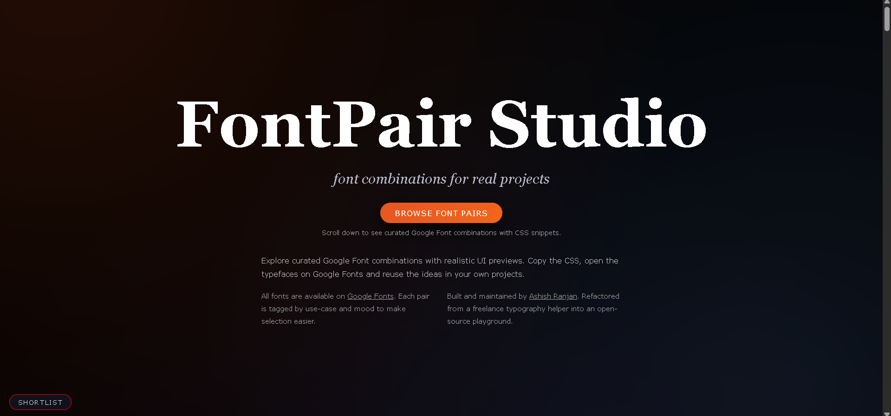


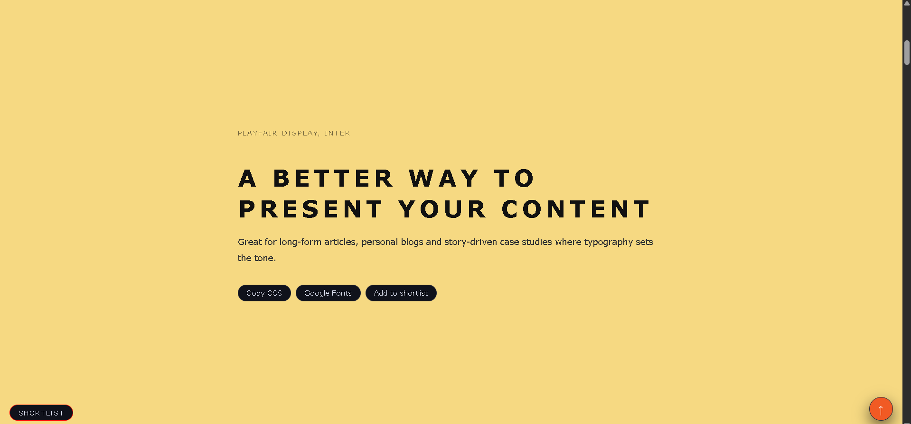

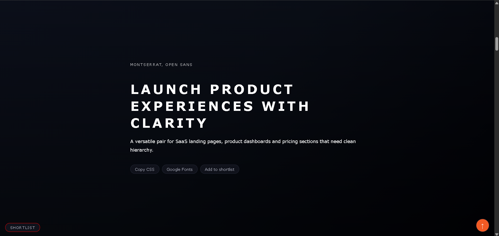

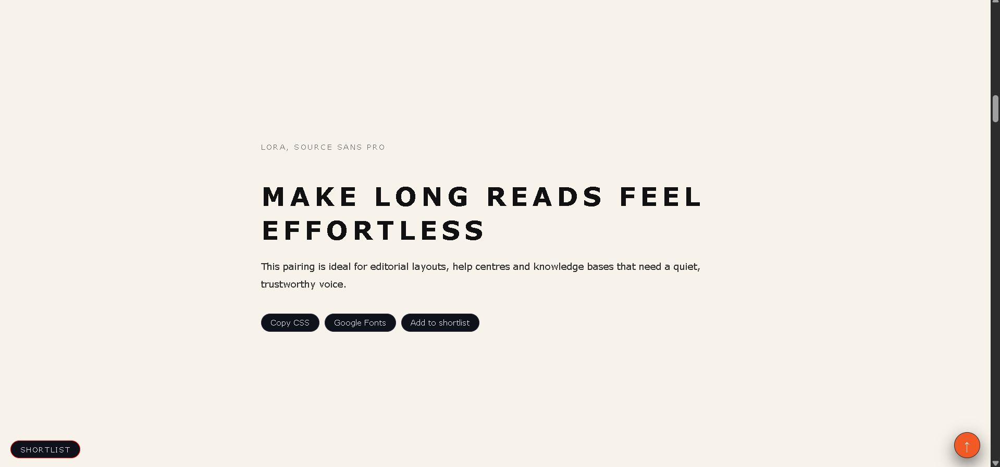

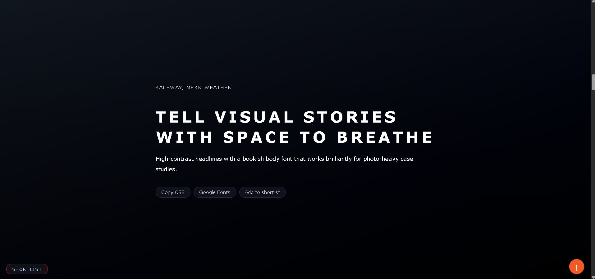

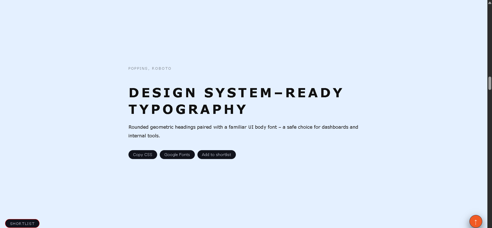

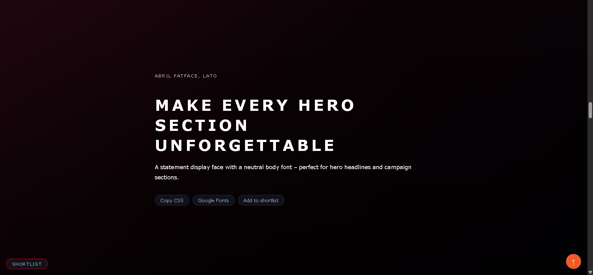

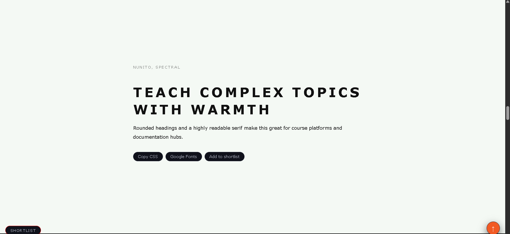

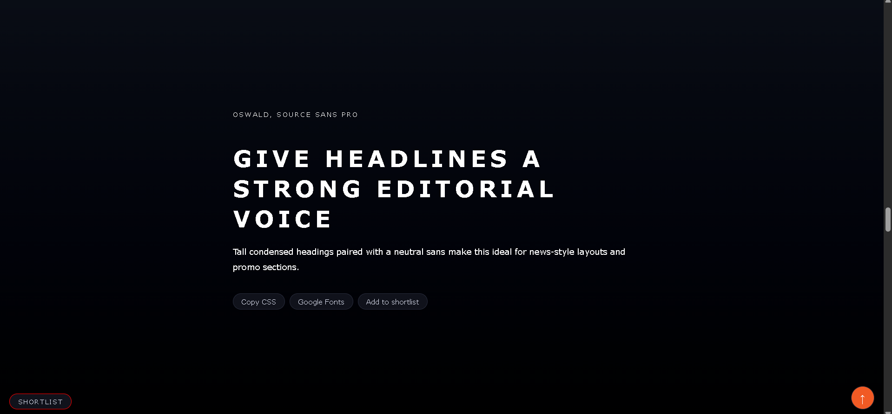

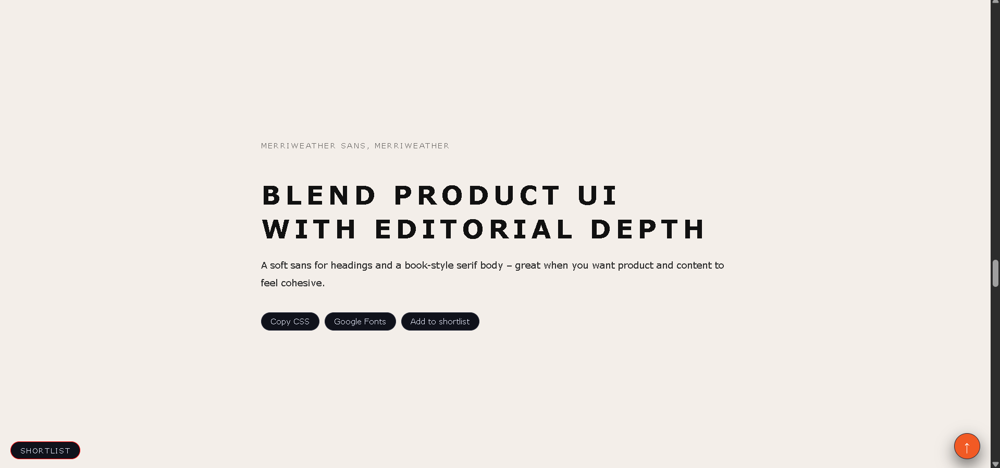

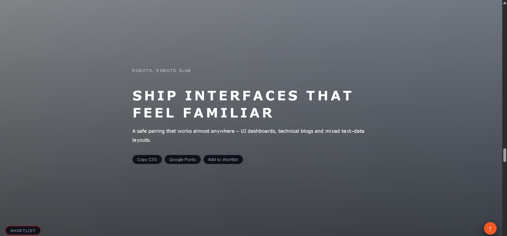

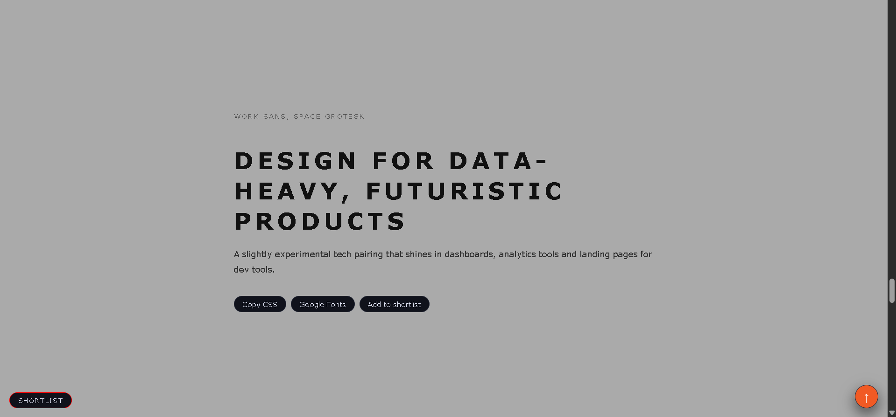

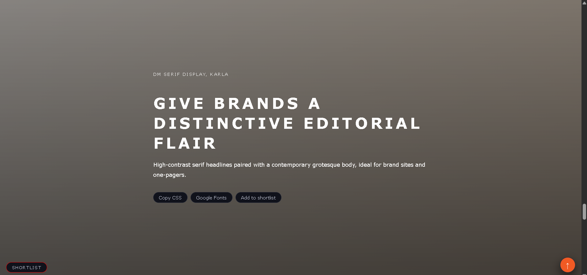

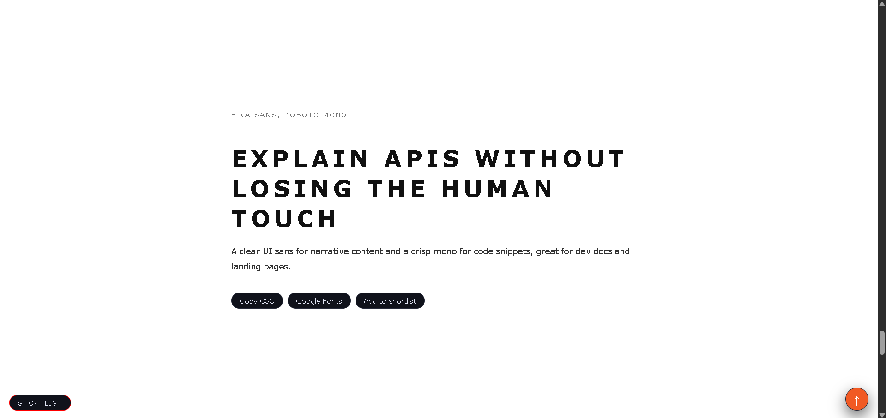


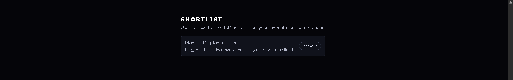

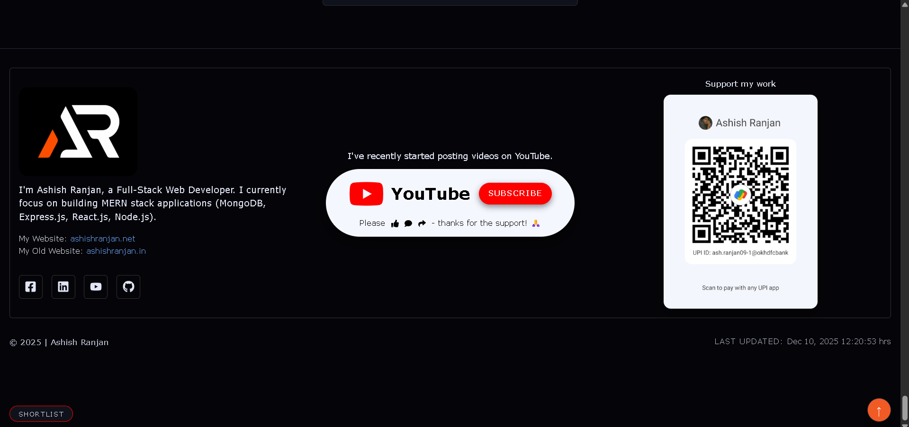

---

## Live demo & repo

-   **Live demo:** [a2rp.github.io/fontpair-studio](https://a2rp.github.io/fontpair-studio)
-   **Repository:** [github.com/a2rp/fontpair-studio](https://github.com/a2rp/fontpair-studio)

---

## Features

-   🎯 **Focused on real-world use-cases**  
    Each font pair is tagged with use-cases (blog, portfolio, SaaS, docs, dashboard, etc.) and moods (elegant, techy, calm, bold…).

-   🖼️ **Full-screen typography slides**  
    Scroll through 100vh sections that showcase each pairing with a hero-style heading and supporting text.

-   🔍 **Search & filter toolbar**

    -   Search by font name or pair
    -   Filter by **use-case**
    -   Filter by **mood**

-   📌 **Shortlist your favourites**

    -   `Add to shortlist` pins the pair for quick reference
    -   Shortlist is stored in `localStorage` (`fps_shortlist`)
    -   Remove action uses a custom confirm modal

-   📋 **Copy-paste CSS in one click**  
    `Copy CSS` copies a small snippet that wires up heading + body fonts with sensible fallbacks.

-   🔗 **Google Fonts shortcuts**  
    `Google Fonts` opens the heading and body fonts directly on fonts.google.com.

-   ⬆️ **UX helpers**

    -   Smooth scroll to sections
    -   Scroll-to-top floating button
    -   "Shortlist" jump button to quickly reach saved pairs

-   🧾 **Footer with creator details**
    -   About Ashish Ranjan (Full-Stack Web Developer)
    -   Website links, social links (GitHub, LinkedIn, Facebook, YouTube)
    -   YouTube **Subscribe** strip styled like a modern channel card
    -   Optional UPI QR support card
    -   Auto-rendered **Last updated** timestamp using build / commit ISO time

---

## Tech stack

-   [React](https://reactjs.org/) (Vite)
-   [Vite](https://vitejs.dev/)
-   [styled-components](https://styled-components.com/)
-   LocalStorage for shortlist persistence
-   Vanilla JS utilities for smooth scrolling & clipboard

---

## Getting started

```bash
git clone https://github.com/a2rp/fontpair-studio.git
cd fontpair-studio
npm install
npm run dev
```

📜 License

---

This project is licensed under the MIT License. You are free to use, modify, and distribute this project with attribution.

## ⭐ Support

If you like this project, please ⭐ star the repository!

---

## ❤️ Support My Work

If my projects, tools or tutorials help you, you can support me:

-   **PayPal:** https://paypal.me/a2rpdev
-   **UPI:** `ash.ranjan09-1@okhdfcbank`


